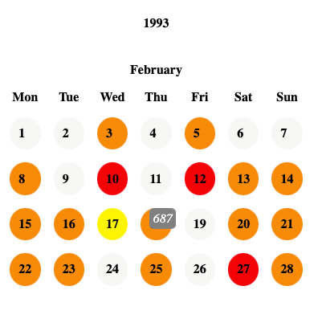

# Calendar Heat Map

Interactive calendar heat map visualization

Upload your file which contains:
1) date column in yyyy-mm-dd format
2) some numeric columns you need to show on calendar
   you can choose several columns to display their sum

CSV file example:

|date      |value_1|value_2|
|----------|-------|-------|
|1993-05-01|1      |2      |
|1992-03-20|3      |4      |
|1992-06-09|5      |6      |
|1992-02-19|7      |8      |

Try:
https://calendarheatmap-97de52753a46.herokuapp.com/

